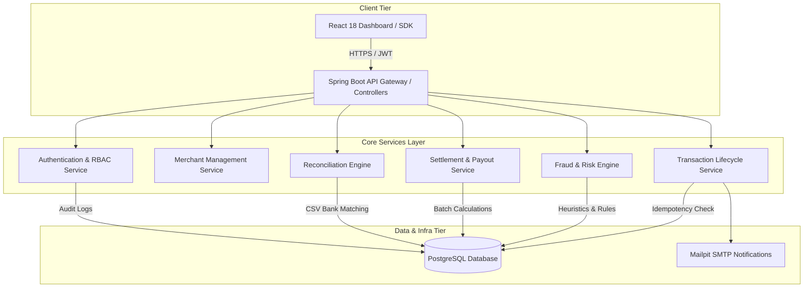

# Software Architecture & Knowledge Document: UtkarshMudgal2802droid/payshield

> *Generated Autonomously by PRISM Agentic Extraction*

## 1. Executive Summary & Problem Statement
PayShield addresses the complex challenges of enterprise payment processing, fraud detection, ledger reconciliation, and merchant settlement. Modern businesses require secure, idempotent, high-concurrency transaction pipelines that can process payments, screen for fraud in milliseconds, reconcile bank statements automatically, and disburse settlements seamlessly while complying with strict security standards.

## 2. Business Value & Presentation Deck
**Pitch:** PayShield is an enterprise-grade payment processing and risk management platform engineered to emulate global PSPs like Stripe and Adyen. Combining high-concurrency Spring Boot microservices-ready architecture, millisecond fraud screening, automated bank reconciliation, and real-time React analytics, PayShield delivers complete financial transaction lifecycle control and uncompromising security for modern digital commerce.

**Value:** Eliminates duplicate transactions and fraud losses through strict idempotency and automated risk heuristics. Accelerates merchant onboarding and reduces operational overhead via automated reconciliation and daily batch settlements with transparent fee deduction.

**Challenges:** Solving concurrency race conditions during simultaneous payment capture attempts, enforcing robust idempotency constraints across multi-step transaction pipelines, and maintaining state machine integrity across state transitions from initialization through settlement.

**Future Scope:** Transitioning from a layered monolith to distributed event-driven microservices via Apache Kafka, integrating machine learning models for dynamic fraud scoring, and supporting multi-currency cross-border settlements.

## 3. Analytics & Flowchart
- **Complexity:** High
- **Modules:** 8
- **Security:** JWT-based authentication, API Key merchant onboarding, password hashing with BCrypt, strict role separation


## 4. Technology Stack
- Java 21
- Spring Boot 3.3
- Spring Security (JWT)
- Spring Data JPA
- Flyway
- PostgreSQL
- React 18
- TypeScript
- Material UI
- Recharts
- Docker
- Mailpit

## 5. Engineering Handover Guide

### Local Setup & Prerequisites
Docker & Docker Compose, Java 21 JDK, Node.js 18+, Maven

### Directory Tour
- **`backend/src/main/java/com/payshield/backend/service/`**: Core business logic implementing transaction state machines, fraud evaluation, merchant management, authentication, and reconciliation.
- **`backend/src/main/java/com/payshield/backend/controller/`**: REST API controllers exposing secure endpoints for merchants, payments, refunds, and admin operations.
- **`frontend/`**: React 18 single-page application with TypeScript, Material UI, and Recharts for live transaction monitoring and merchant reporting.
- **`risk-engine/`**: Dedicated risk assessment and fraud rule evaluation module.

### Critical Workflows
**Transaction Processing & Fraud Check Pipeline**
- *Entry:* `backend/src/main/java/com/payshield/backend/service/FraudService.java`
- *Path:* `API Controller -> Transaction Service -> Idempotency Check -> Fraud Engine -> State Update (AUTHORIZED/FAILED) -> PostgreSQL & Mailpit Notification`

**Merchant Authentication & Onboarding**
- *Entry:* `backend/src/main/java/com/payshield/backend/service/AuthenticationService.java`
- *Path:* `Auth Controller -> Authentication Service -> Password Verification / JWT Generation -> Role Assignment -> PostgreSQL`

### Technical Debt & Fragility
- Asynchronous email notifications via Mailpit lack retry queues for SMTP failures.
- High-concurrency testing relies on Python scripts rather than integrated automated test suites in CI.

## 6. Repository Structure
```text
[DIR]  .github
[DIR]  .github/workflows
[FILE] .github/workflows/ci.yml
[FILE] .gitignore
[FILE] README.md
[DIR]  backend
[FILE] backend/.dockerignore
[FILE] backend/.gitattributes
[FILE] backend/.gitignore
[DIR]  backend/.mvn
[DIR]  backend/.mvn/wrapper
[FILE] backend/.mvn/wrapper/maven-wrapper.properties
[FILE] backend/Dockerfile
[FILE] backend/concurrency_test.py
[FILE] backend/mvnw
[FILE] backend/mvnw.cmd
[FILE] backend/pom.xml
[DIR]  backend/src
[DIR]  backend/src/main
[DIR]  backend/src/main/java
[DIR]  backend/src/main/java/com
[DIR]  backend/src/main/java/com/payshield
[DIR]  backend/src/main/java/com/payshield/backend
[FILE] backend/src/main/java/com/payshield/backend/BackendApplication.java
[DIR]  backend/src/main/java/com/payshield/backend/config
[FILE] backend/src/main/java/com/payshield/backend/config/ApplicationConfig.java
[FILE] backend/src/main/java/com/payshield/backend/config/DataSeeder.java
[FILE] backend/src/main/java/com/payshield/backend/config/SecurityConfiguration.java
[DIR]  backend/src/main/java/com/payshield/backend/controller
[FILE] backend/src/main/java/com/payshield/backend/controller/AuthenticationController.java
[FILE] backend/src/main/java/com/payshield/backend/controller/FraudController.java
[FILE] backend/src/main/java/com/payshield/backend/controller/GlobalExceptionHandler.java
[FILE] backend/src/main/java/com/payshield/backend/controller/MerchantController.java
[FILE] backend/src/main/java/com/payshield/backend/controller/PaymentController.java
[FILE] backend/src/main/java/com/payshield/backend/controller/ReconciliationController.java
[FILE] backend/src/main/java/com/payshield/backend/controller/RefundController.java
[FILE] backend/src/main/java/com/payshield/backend/controller/ReportController.java
[FILE] backend/src/main/java/com/payshield/backend/controller/SettlementController.java
[FILE] backend/src/main/java/com/payshield/backend/controller/WalletController.java
[DIR]  backend/src/main/java/com/payshield/backend/dto
[FILE] backend/src/main/java/com/payshield/backend/dto/AuthenticationRequest.java
[FILE] backend/src/main/java/com/payshield/backend/dto/AuthenticationResponse.java
[FILE] backend/src/main/java/com/payshield/backend/dto/DashboardMetricsResponse.java
[FILE] backend/src/main/java/com/payshield/backend/dto/FraudAssessmentRequest.java
[FILE] backend/src/main/java/com/payshield/backend/dto/FraudAssessmentResponse.java
[FILE] backend/src/main/java/com/payshield/backend/dto/MerchantRequest.java
[FILE] backend/src/main/java/com/payshield/backend/dto/MerchantResponse.java
[FILE] backend/src/main/java/com/payshield/backend/dto/PaymentRequest.java
[FILE] backend/src/main/java/com/payshield/backend/dto/PaymentResponse.java
[FILE] backend/src/main/java/com/payshield/backend/dto/ReconciliationJobResponse.java
[FILE] backend/src/main/java/com/payshield/backend/dto/RefundRequest.java
[FILE] backend/src/main/java/com/payshield/backend/dto/RefundResponse.java
[FILE] backend/src/main/java/com/payshield/backend/dto/RegisterRequest.java
[DIR]  backend/src/main/java/com/payshield/backend/exception
[FILE] backend/src/main/java/com/payshield/backend/exception/ApiError.java
[FILE] backend/src/main/java/com/payshield/backend/exception/FraudDetectedException.java
[FILE] backend/src/main/java/com/payshield/backend/exception/InsufficientBalanceException.java
[DIR]  backend/src/main/java/com/payshield/backend/model
[FILE] backend/src/main/java/com/payshield/backend/model/AuditEvent.java
[FILE] backend/src/main/java/com/payshield/backend/model/FraudAssessment.java
[FILE] backend/src/main/java/com/payshield/backend/model/FraudDecision.java
[FILE] backend/src/main/java/com/payshield/backend/model/FraudRule.java
[FILE] backend/src/main/java/com/payshield/backend/model/IdempotencyRecord.java
[FILE] backend/src/main/java/com/payshield/backend/model/Merchant.java
[FILE] backend/src/main/java/com/payshield/backend/model/MerchantStatus.java
[FILE] backend/src/main/java/com/payshield/backend/model/MismatchType.java
[FILE] backend/src/main/java/com/payshield/backend/model/Payment.java
[FILE] backend/src/main/java/com/payshield/backend/model/PaymentStatus.java
[FILE] backend/src/main/java/com/payshield/backend/model/ReconciliationJob.java
[FILE] backend/src/main/java/com/payshield/backend/model/ReconciliationMismatch.java
[FILE] backend/src/main/java/com/payshield/backend/model/Refund.java
[FILE] backend/src/main/java/com/payshield/backend/model/RefundStatus.java
[FILE] backend/src/main/java/com/payshield/backend/model/Role.java
[FILE] backend/src/main/java/com/payshield/backend/model/Settlement.java
[FILE] backend/src/main/java/com/payshield/backend/model/SettlementStatus.java
[FILE] backend/src/main/java/com/payshield/backend/model/Transaction.java
[FILE] backend/src/main/java/com/payshield/backend/model/User.java
[FILE] backend/src/main/java/com/payshield/backend/model/Wallet.java
[DIR]  backend/src/main/java/com/payshield/backend/repository
[FILE] backend/src/main/java/com/payshield/backend/repository/AuditEventRepository.java
[FILE] backend/src/main/java/com/payshield/backend/repository/FraudAssessmentRepository.java
[FILE] backend/src/main/java/com/payshield/backend/repository/FraudRuleRepository.java
[FILE] backend/src/main/java/com/payshield/backend/repository/IdempotencyRecordRepository.java
[FILE] backend/src/main/java/com/payshield/backend/repository/MerchantRepository.java
[FILE] backend/src/main/java/com/payshield/backend/repository/PaymentRepository.java
[FILE] backend/src/main/java/com/payshield/backend/repository/ReconciliationJobRepository.java
[FILE] backend/src/main/java/com/payshield/backend/repository/ReconciliationMismatchRepository.java
[FILE] backend/src/main/java/com/payshield/backend/repository/RefundRepository.java
[FILE] backend/src/main/java/com/payshield/backend/repository/SettlementRepository.java
[FILE] backend/src/main/java/com/payshield/backend/repository/TransactionRepository.java
[FILE] backend/src/main/java/com/payshield/backend/repository/UserRepository.java
[FILE] backend/src/main/java/com/payshield/backend/repository/WalletRepository.java
[DIR]  backend/src/main/java/com/payshield/backend/security
[FILE] backend/src/main/java/com/payshield/backend/security/JwtAuthenticationFilter.java
[FILE] backend/src/main/java/com/payshield/backend/security/JwtService.java
[FILE] backend/src/main/java/com/payshield/backend/security/RateLimitFilter.java
[DIR]  backend/src/main/java/com/payshield/backend/service
[FILE] backend/src/main/java/com/payshield/backend/service/AuditService.java
[FILE] backend/src/main/java/com/payshield/backend/service/AuthenticationService.java
[FILE] backend/src/main/java/com/payshield/backend/service/FraudService.java
[FILE] backend/src/main/java/com/payshield/backend/service/MerchantService.java
[FILE] backend/src/main/java/com/payshield/backend/service/NotificationService.java
[FILE] backend/src/main/java/com/payshield/backend/service/OtpService.java
[FILE] backend/src/main/java/com/payshield/backend/service/PaymentService.java
[FILE] backend/src/main/java/com/payshield/backend/service/ReconciliationService.java
[FILE] backend/src/main/java/com/payshield/backend/service/RefundService.java
[FILE] backend/src/main/java/com/payshield/backend/service/ReportService.java
[FILE] backend/src/main/java/com/payshield/backend/service/SettlementService.java
[FILE] backend/src/main/java/com/payshield/backend/service/TokenBlacklistService.java
[FILE] backend/src/main/java/com/payshield/backend/service/WalletService.java
[DIR]  backend/src/main/resources
[FILE] backend/src/main/resources/application.yml
[DIR]  backend/src/main/resources/db
[DIR]  backend/src/main/resources/db/migration
[FILE] backend/src/main/resources/db/migration/V10__create_transactions_table.sql
[FILE] backend/src/main/resources/db/migration/V11__fix_transactions_id_type.sql
[FILE] backend/src/main/resources/db/migration/V12__add_session_version.sql
[FILE] backend/src/main/resources/db/migration/V13__add_optimistic_locking_to_wallet.sql
[FILE] backend/src/main/resources/db/migration/V1__init_users_table.sql
[FILE] backend/src/main/resources/db/migration/V2__init_merchants_table.sql
[FILE] backend/src/main/resources/db/migration/V3__init_payments_table.sql
[FILE] backend/src/main/resources/db/migration/V4__init_fraud_table.sql
[FILE] backend/src/main/resources/db/migration/V5__init_refunds_table.sql
[FILE] backend/src/main/resources/db/migration/V6__init_reconciliation_table.sql
[FILE] backend/src/main/resources/db/migration/V7__init_settlement_table.sql
[FILE] backend/src/main/resources/db/migration/V8__init_audit_table.sql
[FILE] backend/src/main/resources/db/migration/V9__init_wallets_table.sql
[DIR]  backend/src/test
[DIR]  backend/src/test/java
[DIR]  backend/src/test/java/com
[DIR]  backend/src/test/java/com/payshield
[DIR]  backend/src/test/java/com/payshield/backend
[DIR]  backend/src/test/java/com/payshield/backend/service
[FILE] backend/src/test/java/com/payshield/backend/service/FraudServiceTest.java
[FILE] backend/src/test/java/com/payshield/backend/service/WalletServiceTest.java
[FILE] backend/utkarsh_test.py
[DIR]  cred-wallet
[FILE] cred-wallet/.gitignore
[FILE] cred-wallet/.oxlintrc.json
[FILE] cred-wallet/README.md
[FILE] cred-wallet/index.html
[FILE] cred-wallet/package-lock.json
[FILE] cred-wallet/package.json
[DIR]  cred-wallet/public
[FILE] cred-wallet/public/favicon.svg
[FILE] cred-wallet/public/icons.svg
[DIR]  cred-wallet/src
[FILE] cred-wallet/src/App.css
[FILE] cred-wallet/src/App.tsx
[DIR]  cred-wallet/src/assets
[FILE] cred-wallet/src/assets/hero.png
[FILE] cred-wallet/src/assets/react.svg
[FILE] cred-wallet/src/assets/vite.svg
[DIR]  cred-wallet/src/context
[FILE] cred-wallet/src/context/AuthContext.tsx
[FILE] cred-wallet/src/index.css
[FILE] cred-wallet/src/main.tsx
[FILE] cred-wallet/src/mockData.ts
[DIR]  cred-wallet/src/pages
[FILE] cred-wallet/src/pages/Dashboard.tsx
[FILE] cred-wallet/src/pages/Login.tsx
[FILE] cred-wallet/src/pages/Signup.tsx
[FILE] cred-wallet/src/pages/Transfer.tsx
[FILE] cred-wallet/tsconfig.app.json
[FILE] cred-wallet/tsconfig.json
[FILE] cred-wallet/tsconfig.node.json
[FILE] cred-wallet/vite.config.ts
[FILE] docker-compose.yml
[DIR]  docs
[DIR]  docs/agile
[FILE] docs/agile/JIRA_Backlog_Export.csv
[FILE] docs/agile/Sprint_Retrospectives.md
[DIR]  docs/incidents
[FILE] docs/incidents/INC-4029_Post_Mortem.md
[DIR]  docs/sops
[FILE] docs/sops/Incident_Response_SOP.md
[DIR]  frontend
[FILE] frontend/.dockerignore
[FILE] frontend/.gitignore
[FILE] frontend/.oxlintrc.json
[FILE] frontend/Dockerfile
[FILE] frontend/README.md
[FILE] frontend/index.html
[FILE] frontend/package-lock.json
[FILE] frontend/package.json
[DIR]  frontend/public
[FILE] frontend/public/favicon.svg
[FILE] frontend/public/icons.svg
[DIR]  frontend/src
[FILE] frontend/src/App.css
[FILE] frontend/src/App.tsx
[DIR]  frontend/src/assets
[FILE] frontend/src/assets/hero.png
[FILE] frontend/src/assets/react.svg
[FILE] frontend/src/assets/vite.svg
[DIR]  frontend/src/context
[FILE] frontend/src/context/AuthContext.tsx
[FILE] frontend/src/index.css
[FILE] frontend/src/main.tsx
[FILE] frontend/src/mockData.ts
... (truncated)
```

## 7. Technical Architecture & Component Knowledge

### Domain: Technical Decision

#### Idempotency Architecture for Transaction Safety
- **Affected Module:** `backend/src/main/java/com/payshield/backend/service/`
- **AI Confidence Score:** 98%

**Executive Summary:**
Implementation of idempotency keys in payment processing to prevent duplicate charges caused by network retries.

**Implementation Details & Context:**
The system mandates the inclusion of an `Idempotency-Key` header for transaction requests, caching and returning previously processed responses if duplicate requests arrive.

**Traceability & Evidence (Code Pointers):**
- `backend/src/main/java/com/payshield/backend/service/`

---

#### State Machine Payment Lifecycle Management
- **Affected Module:** `backend/src/main/java/com/payshield/backend/service/`
- **AI Confidence Score:** 96%

**Executive Summary:**
Enforcement of strict state transitions across payment lifecycles.

**Implementation Details & Context:**
Transactions progress systematically from INITIATED -> FRAUD_CHECK -> AUTHORIZED/FAILED -> CAPTURED, ensuring ledger consistency at every step.

**Traceability & Evidence (Code Pointers):**
- `backend/src/main/java/com/payshield/backend/service/`

---

#### Audit Logging and Immutable Compliance
- **Affected Module:** `backend/src/main/java/com/payshield/backend/service/AuditService.java`
- **AI Confidence Score:** 94%

**Executive Summary:**
Comprehensive audit logging for all critical system actions and financial state changes.

**Implementation Details & Context:**
AuditService records administrative and transactional actions to maintain traceability and meet regulatory compliance requirements.

**Traceability & Evidence (Code Pointers):**
- `backend/src/main/java/com/payshield/backend/service/AuditService.java`

---

#### React 18 & Recharts Real-Time Analytics Dashboard
- **Affected Module:** `frontend/`
- **AI Confidence Score:** 94%

**Executive Summary:**
Modern single-page frontend delivering real-time financial reporting and transaction visualization.

**Implementation Details & Context:**
Built with React 18, TypeScript, Material UI, and Recharts, the frontend offers merchants and administrators real-time insights into volume, success rates, and risk metrics.

**Traceability & Evidence (Code Pointers):**
- `frontend/`

---

#### Flyway Database Migration Management
- **Affected Module:** `backend/src/main/resources/db/migration/`
- **AI Confidence Score:** 96%

**Executive Summary:**
Version-controlled database schema evolution using Flyway.

**Implementation Details & Context:**
Automates database schema deployment and versioning upon application startup, ensuring consistent schema states across environments.

**Traceability & Evidence (Code Pointers):**
- `backend/`

---

### Domain: Business Logic

#### Millisecond Fraud Risk Engine Heuristics
- **Affected Module:** `backend/src/main/java/com/payshield/backend/service/FraudService.java`
- **AI Confidence Score:** 97%

**Executive Summary:**
Real-time transaction risk scoring based on amount limits and suspicious domain heuristics.

**Implementation Details & Context:**
FraudService evaluates incoming transactions against velocity rules, threshold amounts, and blacklisted domains to instantly block high-risk payments.

**Traceability & Evidence (Code Pointers):**
- `backend/src/main/java/com/payshield/backend/service/FraudService.java`

---

#### Automated Reconciliation Engine
- **Affected Module:** `backend/src/main/java/com/payshield/backend/service/`
- **AI Confidence Score:** 95%

**Executive Summary:**
Automated matching of simulated bank CSV statements against internal database records.

**Implementation Details & Context:**
The reconciliation engine parses bank settlement files, cross-references transaction IDs and amounts, and flags discrepancies automatically.

**Traceability & Evidence (Code Pointers):**
- `backend/src/main/java/com/payshield/backend/service/`

---

#### Daily Batch Settlement and Fee Calculation
- **Affected Module:** `backend/src/main/java/com/payshield/backend/service/`
- **AI Confidence Score:** 95%

**Executive Summary:**
Daily batch aggregation of captured funds with automatic 2.9% simulation fee deduction.

**Implementation Details & Context:**
Settlement service processes captured transactions in batch runs, computes merchant payouts minus platform fees, and generates payout ledgers.

**Traceability & Evidence (Code Pointers):**
- `backend/src/main/java/com/payshield/backend/service/`

---

#### Merchant Onboarding and API Key Generation
- **Affected Module:** `backend/src/main/java/com/payshield/backend/service/MerchantService.java`
- **AI Confidence Score:** 95%

**Executive Summary:**
Secure provisioning of merchant accounts and unique API credentials.

**Implementation Details & Context:**
MerchantService handles merchant registration, profile management, and secure API key generation for programmatic payment submissions.

**Traceability & Evidence (Code Pointers):**
- `backend/src/main/java/com/payshield/backend/service/MerchantService.java`

---

### Domain: Security Architecture

#### JWT and RBAC Security Architecture
- **Affected Module:** `backend/src/main/java/com/payshield/backend/security/`
- **AI Confidence Score:** 97%

**Executive Summary:**
Robust authentication and authorization using Spring Security, JWT tokens, and BCrypt hashing.

**Implementation Details & Context:**
Endpoints are protected by role-based access control (Admin vs. Merchant), securing access to sensitive operational and financial records.

**Traceability & Evidence (Code Pointers):**
- `backend/src/main/java/com/payshield/backend/security/`

---

### Domain: Infrastructure

#### SMTP Notification Integration via Mailpit
- **Affected Module:** `backend/src/main/java/com/payshield/backend/service/NotificationService.java`
- **AI Confidence Score:** 93%

**Executive Summary:**
Local email notification simulation using Mailpit for payment confirmations and alerts.

**Implementation Details & Context:**
NotificationService dispatches email notifications for transaction status changes, integrated seamlessly with Docker Compose for local development.

**Traceability & Evidence (Code Pointers):**
- `backend/src/main/java/com/payshield/backend/service/NotificationService.java`

---

#### Dockerized Multi-Container Development Environment
- **Affected Module:** `docker-compose.yml`
- **AI Confidence Score:** 98%

**Executive Summary:**
Docker Compose orchestration for PostgreSQL, Mailpit, backend, and frontend services.

**Implementation Details & Context:**
Ensures reproducible deployments and local development parity across environments through containerized services.

**Traceability & Evidence (Code Pointers):**
- `docker-compose.yml`

---

