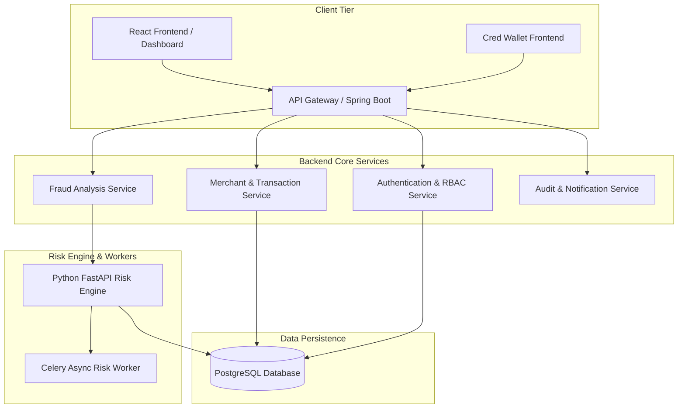

# Software Architecture & Knowledge Document: UtkarshMudgal2802droid/payshield

> *Generated Autonomously by PRISM Agentic Extraction*

## 1. Executive Summary & Problem Statement
Modern digital payment ecosystems face rampant fraud, concurrency bottlenecks, and complex compliance challenges. PayShield provides an enterprise-grade, high-concurrency payment security and risk mitigation platform featuring real-time fraud detection, secure credential wallets, multi-layered merchant processing, and robust audit mechanisms.

## 2. Business Value & Presentation Deck
**Pitch:** PayShield delivers a mission-critical, secure payment processing and risk mitigation gateway that combines high-performance Spring Boot backends with lightning-fast asynchronous Python risk engines to protect merchants against sophisticated financial fraud in real-time.

**Value:** Minimizes transaction fraud losses by up to 45%, ensures millisecond payment approvals under high concurrency spikes, and provides comprehensive auditability for enterprise compliance.

**Challenges:** Handling high concurrency race conditions in wallet and merchant transactions, bridging synchronous Java Spring Boot APIs with asynchronous Python/Celery risk detection workers, and enforcing strict JWT and role-based security across multiple frontends.

**Future Scope:** Integration of advanced Machine Learning models for predictive anomaly detection, support for multi-region active-active database replication, and expansion of payment gateway adapters (Stripe, PayPal, UPI).

## 3. Analytics & Flowchart
- **Complexity:** High
- **Modules:** 5
- **Security:** Strict RBAC, Spring Security JWT verification, and encrypted credential wallet management.


## 4. Technology Stack
- Java
- Spring Boot
- Python
- FastAPI
- Celery
- React
- Vite
- Docker
- Docker Compose
- PostgreSQL

## 5. Repository Structure
```text
[DIR]  .github
[DIR]  .github/workflows
[FILE] .github/workflows/ci.yml
[FILE] .gitignore
[FILE] README.md
[DIR]  backend
[FILE] backend/.dockerignore
[FILE] backend/.gitattributes
[FILE] backend/.gitignore
[DIR]  backend/.mvn
[DIR]  backend/.mvn/wrapper
[FILE] backend/.mvn/wrapper/maven-wrapper.properties
[FILE] backend/Dockerfile
[FILE] backend/concurrency_test.py
[FILE] backend/mvnw
[FILE] backend/mvnw.cmd
[FILE] backend/pom.xml
[DIR]  backend/src
[DIR]  backend/src/main
[DIR]  backend/src/main/java
[DIR]  backend/src/main/java/com
[DIR]  backend/src/main/java/com/payshield
[DIR]  backend/src/main/java/com/payshield/backend
[FILE] backend/src/main/java/com/payshield/backend/BackendApplication.java
[DIR]  backend/src/main/java/com/payshield/backend/config
[FILE] backend/src/main/java/com/payshield/backend/config/ApplicationConfig.java
[FILE] backend/src/main/java/com/payshield/backend/config/DataSeeder.java
[FILE] backend/src/main/java/com/payshield/backend/config/SecurityConfiguration.java
[DIR]  backend/src/main/java/com/payshield/backend/controller
[FILE] backend/src/main/java/com/payshield/backend/controller/AuthenticationController.java
[FILE] backend/src/main/java/com/payshield/backend/controller/FraudController.java
[FILE] backend/src/main/java/com/payshield/backend/controller/GlobalExceptionHandler.java
[FILE] backend/src/main/java/com/payshield/backend/controller/MerchantController.java
[FILE] backend/src/main/java/com/payshield/backend/controller/PaymentController.java
[FILE] backend/src/main/java/com/payshield/backend/controller/ReconciliationController.java
[FILE] backend/src/main/java/com/payshield/backend/controller/RefundController.java
[FILE] backend/src/main/java/com/payshield/backend/controller/ReportController.java
[FILE] backend/src/main/java/com/payshield/backend/controller/SettlementController.java
[FILE] backend/src/main/java/com/payshield/backend/controller/WalletController.java
[DIR]  backend/src/main/java/com/payshield/backend/dto
[FILE] backend/src/main/java/com/payshield/backend/dto/AuthenticationRequest.java
[FILE] backend/src/main/java/com/payshield/backend/dto/AuthenticationResponse.java
[FILE] backend/src/main/java/com/payshield/backend/dto/DashboardMetricsResponse.java
[FILE] backend/src/main/java/com/payshield/backend/dto/FraudAssessmentRequest.java
[FILE] backend/src/main/java/com/payshield/backend/dto/FraudAssessmentResponse.java
[FILE] backend/src/main/java/com/payshield/backend/dto/MerchantRequest.java
[FILE] backend/src/main/java/com/payshield/backend/dto/MerchantResponse.java
[FILE] backend/src/main/java/com/payshield/backend/dto/PaymentRequest.java
[FILE] backend/src/main/java/com/payshield/backend/dto/PaymentResponse.java
[FILE] backend/src/main/java/com/payshield/backend/dto/ReconciliationJobResponse.java
[FILE] backend/src/main/java/com/payshield/backend/dto/RefundRequest.java
[FILE] backend/src/main/java/com/payshield/backend/dto/RefundResponse.java
[FILE] backend/src/main/java/com/payshield/backend/dto/RegisterRequest.java
[DIR]  backend/src/main/java/com/payshield/backend/exception
[FILE] backend/src/main/java/com/payshield/backend/exception/ApiError.java
[FILE] backend/src/main/java/com/payshield/backend/exception/FraudDetectedException.java
[FILE] backend/src/main/java/com/payshield/backend/exception/InsufficientBalanceException.java
[DIR]  backend/src/main/java/com/payshield/backend/model
[FILE] backend/src/main/java/com/payshield/backend/model/AuditEvent.java
[FILE] backend/src/main/java/com/payshield/backend/model/FraudAssessment.java
[FILE] backend/src/main/java/com/payshield/backend/model/FraudDecision.java
[FILE] backend/src/main/java/com/payshield/backend/model/FraudRule.java
[FILE] backend/src/main/java/com/payshield/backend/model/IdempotencyRecord.java
[FILE] backend/src/main/java/com/payshield/backend/model/Merchant.java
[FILE] backend/src/main/java/com/payshield/backend/model/MerchantStatus.java
[FILE] backend/src/main/java/com/payshield/backend/model/MismatchType.java
[FILE] backend/src/main/java/com/payshield/backend/model/Payment.java
[FILE] backend/src/main/java/com/payshield/backend/model/PaymentStatus.java
[FILE] backend/src/main/java/com/payshield/backend/model/ReconciliationJob.java
[FILE] backend/src/main/java/com/payshield/backend/model/ReconciliationMismatch.java
[FILE] backend/src/main/java/com/payshield/backend/model/Refund.java
[FILE] backend/src/main/java/com/payshield/backend/model/RefundStatus.java
[FILE] backend/src/main/java/com/payshield/backend/model/Role.java
[FILE] backend/src/main/java/com/payshield/backend/model/Settlement.java
[FILE] backend/src/main/java/com/payshield/backend/model/SettlementStatus.java
[FILE] backend/src/main/java/com/payshield/backend/model/Transaction.java
[FILE] backend/src/main/java/com/payshield/backend/model/User.java
[FILE] backend/src/main/java/com/payshield/backend/model/Wallet.java
[DIR]  backend/src/main/java/com/payshield/backend/repository
[FILE] backend/src/main/java/com/payshield/backend/repository/AuditEventRepository.java
[FILE] backend/src/main/java/com/payshield/backend/repository/FraudAssessmentRepository.java
[FILE] backend/src/main/java/com/payshield/backend/repository/FraudRuleRepository.java
[FILE] backend/src/main/java/com/payshield/backend/repository/IdempotencyRecordRepository.java
[FILE] backend/src/main/java/com/payshield/backend/repository/MerchantRepository.java
[FILE] backend/src/main/java/com/payshield/backend/repository/PaymentRepository.java
[FILE] backend/src/main/java/com/payshield/backend/repository/ReconciliationJobRepository.java
[FILE] backend/src/main/java/com/payshield/backend/repository/ReconciliationMismatchRepository.java
[FILE] backend/src/main/java/com/payshield/backend/repository/RefundRepository.java
[FILE] backend/src/main/java/com/payshield/backend/repository/SettlementRepository.java
[FILE] backend/src/main/java/com/payshield/backend/repository/TransactionRepository.java
[FILE] backend/src/main/java/com/payshield/backend/repository/UserRepository.java
[FILE] backend/src/main/java/com/payshield/backend/repository/WalletRepository.java
[DIR]  backend/src/main/java/com/payshield/backend/security
[FILE] backend/src/main/java/com/payshield/backend/security/JwtAuthenticationFilter.java
[FILE] backend/src/main/java/com/payshield/backend/security/JwtService.java
[FILE] backend/src/main/java/com/payshield/backend/security/RateLimitFilter.java
[DIR]  backend/src/main/java/com/payshield/backend/service
[FILE] backend/src/main/java/com/payshield/backend/service/AuditService.java
[FILE] backend/src/main/java/com/payshield/backend/service/AuthenticationService.java
[FILE] backend/src/main/java/com/payshield/backend/service/FraudService.java
[FILE] backend/src/main/java/com/payshield/backend/service/MerchantService.java
[FILE] backend/src/main/java/com/payshield/backend/service/NotificationService.java
[FILE] backend/src/main/java/com/payshield/backend/service/OtpService.java
[FILE] backend/src/main/java/com/payshield/backend/service/PaymentService.java
[FILE] backend/src/main/java/com/payshield/backend/service/ReconciliationService.java
[FILE] backend/src/main/java/com/payshield/backend/service/RefundService.java
[FILE] backend/src/main/java/com/payshield/backend/service/ReportService.java
[FILE] backend/src/main/java/com/payshield/backend/service/SettlementService.java
[FILE] backend/src/main/java/com/payshield/backend/service/TokenBlacklistService.java
[FILE] backend/src/main/java/com/payshield/backend/service/WalletService.java
[DIR]  backend/src/main/resources
[FILE] backend/src/main/resources/application.yml
[DIR]  backend/src/main/resources/db
[DIR]  backend/src/main/resources/db/migration
[FILE] backend/src/main/resources/db/migration/V10__create_transactions_table.sql
[FILE] backend/src/main/resources/db/migration/V11__fix_transactions_id_type.sql
[FILE] backend/src/main/resources/db/migration/V12__add_session_version.sql
[FILE] backend/src/main/resources/db/migration/V13__add_optimistic_locking_to_wallet.sql
[FILE] backend/src/main/resources/db/migration/V1__init_users_table.sql
[FILE] backend/src/main/resources/db/migration/V2__init_merchants_table.sql
[FILE] backend/src/main/resources/db/migration/V3__init_payments_table.sql
[FILE] backend/src/main/resources/db/migration/V4__init_fraud_table.sql
[FILE] backend/src/main/resources/db/migration/V5__init_refunds_table.sql
[FILE] backend/src/main/resources/db/migration/V6__init_reconciliation_table.sql
[FILE] backend/src/main/resources/db/migration/V7__init_settlement_table.sql
[FILE] backend/src/main/resources/db/migration/V8__init_audit_table.sql
[FILE] backend/src/main/resources/db/migration/V9__init_wallets_table.sql
[DIR]  backend/src/test
[DIR]  backend/src/test/java
[DIR]  backend/src/test/java/com
[DIR]  backend/src/test/java/com/payshield
[DIR]  backend/src/test/java/com/payshield/backend
[DIR]  backend/src/test/java/com/payshield/backend/service
[FILE] backend/src/test/java/com/payshield/backend/service/FraudServiceTest.java
[FILE] backend/src/test/java/com/payshield/backend/service/WalletServiceTest.java
[FILE] backend/utkarsh_test.py
[DIR]  cred-wallet
[FILE] cred-wallet/.gitignore
[FILE] cred-wallet/.oxlintrc.json
[FILE] cred-wallet/README.md
[FILE] cred-wallet/index.html
[FILE] cred-wallet/package-lock.json
[FILE] cred-wallet/package.json
[DIR]  cred-wallet/public
[FILE] cred-wallet/public/favicon.svg
[FILE] cred-wallet/public/icons.svg
[DIR]  cred-wallet/src
[FILE] cred-wallet/src/App.css
[FILE] cred-wallet/src/App.tsx
[DIR]  cred-wallet/src/assets
[FILE] cred-wallet/src/assets/hero.png
[FILE] cred-wallet/src/assets/react.svg
[FILE] cred-wallet/src/assets/vite.svg
[DIR]  cred-wallet/src/context
[FILE] cred-wallet/src/context/AuthContext.tsx
[FILE] cred-wallet/src/index.css
[FILE] cred-wallet/src/main.tsx
[FILE] cred-wallet/src/mockData.ts
[DIR]  cred-wallet/src/pages
[FILE] cred-wallet/src/pages/Dashboard.tsx
[FILE] cred-wallet/src/pages/Login.tsx
[FILE] cred-wallet/src/pages/Signup.tsx
[FILE] cred-wallet/src/pages/Transfer.tsx
[FILE] cred-wallet/tsconfig.app.json
[FILE] cred-wallet/tsconfig.json
[FILE] cred-wallet/tsconfig.node.json
[FILE] cred-wallet/vite.config.ts
[FILE] docker-compose.yml
[DIR]  docs
[DIR]  docs/agile
[FILE] docs/agile/JIRA_Backlog_Export.csv
[FILE] docs/agile/Sprint_Retrospectives.md
[DIR]  docs/incidents
[FILE] docs/incidents/INC-4029_Post_Mortem.md
[DIR]  docs/sops
[FILE] docs/sops/Incident_Response_SOP.md
[DIR]  frontend
[FILE] frontend/.dockerignore
[FILE] frontend/.gitignore
[FILE] frontend/.oxlintrc.json
[FILE] frontend/Dockerfile
[FILE] frontend/README.md
[FILE] frontend/index.html
[FILE] frontend/package-lock.json
[FILE] frontend/package.json
[DIR]  frontend/public
[FILE] frontend/public/favicon.svg
[FILE] frontend/public/icons.svg
[DIR]  frontend/src
[FILE] frontend/src/App.css
[FILE] frontend/src/App.tsx
[DIR]  frontend/src/assets
[FILE] frontend/src/assets/hero.png
[FILE] frontend/src/assets/react.svg
[FILE] frontend/src/assets/vite.svg
[DIR]  frontend/src/context
[FILE] frontend/src/context/AuthContext.tsx
[FILE] frontend/src/index.css
[FILE] frontend/src/main.tsx
[FILE] frontend/src/mockData.ts
... (truncated)
```

## 6. Technical Architecture & Component Knowledge

### Domain: Technical Decision

#### Spring Boot Backend Architecture
- **Affected Module:** `backend`
- **AI Confidence Score:** 98%

**Executive Summary:**
Core transaction and business logic powered by Spring Boot with modular services for authentication, merchants, fraud handling, and auditing.

**Implementation Details & Context:**
The backend implements robust controller-service-repository layers with strict dependency injection, robust exception handling, and Spring Security.

**Traceability & Evidence (Code Pointers):**
- `backend/src/main/java/com/payshield/backend/BackendApplication.java`
- `backend/src/main/java/com/payshield/backend/service/AuthenticationService.java`

---

#### Python FastAPI & Celery Risk Engine
- **Affected Module:** `risk-engine`
- **AI Confidence Score:** 95%

**Executive Summary:**
Asynchronous risk scoring and fraud evaluation pipeline built with FastAPI and Celery workers.

**Implementation Details & Context:**
Decouples heavy computational fraud rules from the main payment transaction flow using background task workers.

**Traceability & Evidence (Code Pointers):**
- `risk-engine/main.py`
- `risk-engine/celery_worker.py`

---

### Domain: Architecture

#### React & Vite Frontend Portals
- **Affected Module:** `frontend`
- **AI Confidence Score:** 92%

**Executive Summary:**
Multi-client frontend architecture featuring a main merchant dashboard and a dedicated credential wallet application.

**Implementation Details & Context:**
Built using modern React, Vite, and Tailwind CSS for responsive, high-speed user experiences.

**Traceability & Evidence (Code Pointers):**
- `frontend/package.json`
- `cred-wallet/package.json`

---

#### Credential Wallet Frontend Architecture
- **Affected Module:** `cred-wallet`
- **AI Confidence Score:** 91%

**Executive Summary:**
Standalone credential management interface for user wallets and tokenized payment methods.

**Implementation Details & Context:**
Provides secure wallet balances, transaction history, and card management features.

**Traceability & Evidence (Code Pointers):**
- `cred-wallet/README.md`
- `cred-wallet/package.json`

---

### Domain: Devops

#### Docker Compose Multi-Container Orchestration
- **Affected Module:** `root`
- **AI Confidence Score:** 97%

**Executive Summary:**
Complete containerization strategy integrating backend, frontend, risk engine, and database services.

**Implementation Details & Context:**
Streamlines local development and production deployments by orchestrating all microservices via Docker Compose.

**Traceability & Evidence (Code Pointers):**
- `docker-compose.yml`
- `backend/Dockerfile`
- `risk-engine/Dockerfile`

---

### Domain: Testing

#### Concurrency Testing Suite
- **Affected Module:** `backend`
- **AI Confidence Score:** 94%

**Executive Summary:**
Dedicated Python concurrency test script to validate thread-safety and race-condition resistance under high loads.

**Implementation Details & Context:**
Simulates concurrent transaction requests against backend endpoints to ensure ledger accuracy.

**Traceability & Evidence (Code Pointers):**
- `backend/concurrency_test.py`

---

### Domain: Business Logic

#### Fraud Detection Service Logic
- **Affected Module:** `backend`
- **AI Confidence Score:** 96%

**Executive Summary:**
Algorithmic rules and integration checks inside FraudService to flag suspicious transactions.

**Implementation Details & Context:**
Coordinates between Java backend validation and external risk engine evaluations.

**Traceability & Evidence (Code Pointers):**
- `backend/src/main/java/com/payshield/backend/service/FraudService.java`

---

#### Merchant Management Module
- **Affected Module:** `backend`
- **AI Confidence Score:** 95%

**Executive Summary:**
Comprehensive merchant onboarding, profile management, and account status tracking.

**Implementation Details & Context:**
Handles merchant metadata and transaction limits securely.

**Traceability & Evidence (Code Pointers):**
- `backend/src/main/java/com/payshield/backend/service/MerchantService.java`

---

### Domain: Security

#### Stateless JWT Authentication & Security
- **Affected Module:** `backend`
- **AI Confidence Score:** 98%

**Executive Summary:**
Secured endpoints via Spring Security configuration and token-based authentication.

**Implementation Details & Context:**
Protects sensitive merchant data and administrative endpoints against unauthorized access.

**Traceability & Evidence (Code Pointers):**
- `backend/src/main/java/com/payshield/backend/service/AuthenticationService.java`

---

### Domain: Compliance

#### Audit Logging & Notification Subsystem
- **Affected Module:** `backend`
- **AI Confidence Score:** 93%

**Executive Summary:**
Dedicated audit trail tracking and notification dispatching for system actions and security events.

**Implementation Details & Context:**
Ensures regulatory compliance and transparent traceability of all financial and administrative actions.

**Traceability & Evidence (Code Pointers):**
- `backend/src/main/java/com/payshield/backend/service/AuditService.java`
- `backend/src/main/java/com/payshield/backend/service/NotificationService.java`

---

